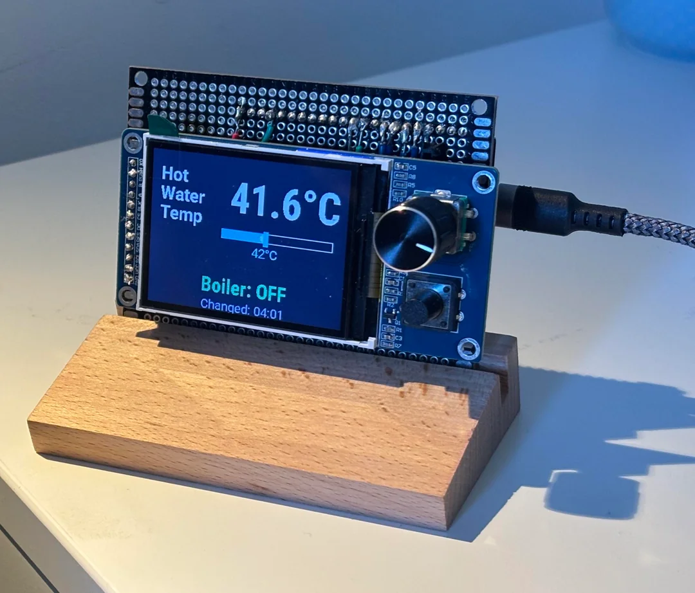
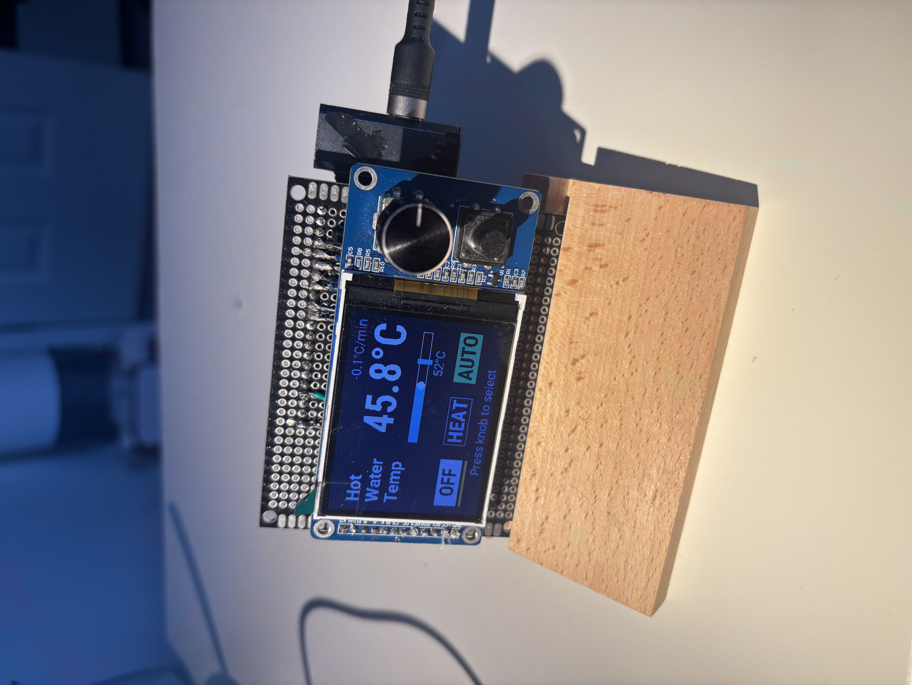
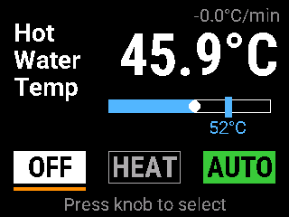
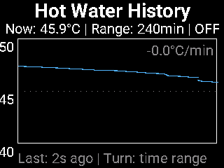
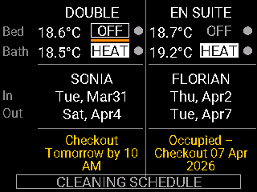
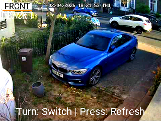
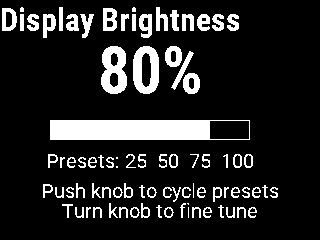

# tadoHotWaterKnob (v2.0)
## ESP32-S3 + ST7789 Smart Hot Water & Boiler Controller

A high-performance Smart Hot Water & Boiler Controller built on the ESP32-S3, featuring a rich 5-page UI, real-time analytics, and deep integration with Home Assistant and Tado.

  

  
  
  

This project has evolved from a simple temperature dial into a comprehensive household dashboard, managing hot water, room heating, occupancy tracking, and even security camera snapshots.

  
  
  

  
  

---

## Hardware & Build Context

This is not just a software project; the hardware choices and physical assembly are critical to the performance and reliability of the controller.

### Parts List
- **Controller**: ESP32-S3 (N16R8). Lesser ESP32s simply do not have the (PS)RAM required to cope with drawing the complex UI, handling image buffers, and maintaining the history graph.
- **Display & Encoder**: EC11 Rotary encoder with push button and 2.8" 320x240 TFT display (ST7789V or ILI9341). These are frequently sold as a package on AliExpress.
- **Sensors**: 
  - The project uses temperature data pulled from Home Assistant.
  - In my specific setup, I have a DS18B20 temperature probe inserted directly into the temperature port of the hot water tank. This probe is connected to a separate ESP32 POE (Power over Ethernet) unit for a rock-solid, wired connection to Home Assistant.
- **Misc**: Perfboard, 2.54mm female headers, solder, and hookup wire.

### The "Quick and Dirty" Assembly
I opted for a functional, robust prototype build rather than a custom PCB. I mounted the components on a perfboard, soldering female header pins to create a dual-sided "motherboard":
- The ESP32-S3 DevKit plugs into one side.
- The Rotary Encoder / TFT Screen combo plugs into the other side.
- Point-to-point wiring joins the pins, creating a compact "sandwich" that can be easily mounted or serviced.

To finish the desktop build, I crafted a simple but effective stand from a solid piece of wood. I routed a precise slot into the wood at a specific angle, allowing the perfboard motherboard to sit securely within it. This keeps the display at an ideal viewing angle for a TFT screen, preventing the color shift and contrast loss typical of these panels when viewed off-axis.

### Pinout (ESP32-S3 DevKitC-1)

| Function | GPIO | Notes |
|---|---:|---|
| Rotary Encoder A | GPIO2 | INPUT_PULLUP |
| Rotary Encoder B | GPIO3 | INPUT_PULLUP |
| Knob Push Button | GPIO1 | INPUT_PULLUP, inverted |
| Navigation Button | GPIO4 | INPUT_PULLUP, inverted |
| TFT SPI MOSI | GPIO11 | Shared SPI bus |
| TFT SPI SCLK | GPIO12 | Shared SPI bus |
| TFT CS | GPIO10 | Chip Select |
| TFT DC | GPIO9 | Data/Command |
| TFT RST | GPIO8 | Hardware Reset |
| TFT Backlight | GPIO13 | ledc PWM control |

---

## Key Features

- **Advanced Water Control**: Large real-time temperature display, usage rate calculation (°C/min), and a visual target bar.
- **Analytics**: Built-in 4-hour temperature history graph with adjustable time range presets.
- **Guest & Room Dashboard**: Dual-column layout tracking temperatures and occupancy for multiple rooms (Double & En-Suite) using Home Assistant presence sensors.
- **Cleaning Schedule**: Real-time fetch of upcoming cleaning appointments from an external API.
- **Security Integration**: Full-screen camera snapshots (Front & Garden) served via an external image proxy.
- **Manual Overrides**: Physical toggles for boiler state (OFF/HEAT) and an Automation Killswitch (AUTO) to suspend Home Assistant logic.
- **Sleep & Brightness**: Auto-dimming, sleep/wake logic, and fine-grained brightness control (10-100%).

---

## UI Structure (5 Pages)

### 1. Main Control
Large temperature readout with color-coded "Usage Rate" indicator and interactive target slider. Includes three large toggle buttons for OFF, HEAT, and AUTO.

### 2. History Graph
Visualizes the last 4 hours of water temperature. Supports adjustable time windows (10min to 4hr) via the rotary knob.

### 3. Guest & Room Info
Tracks temperatures and presence for guest rooms. Includes a sub-view for the Cleaning Schedule fetched from the household server.

### 4. Camera View
Full-screen snapshots from the Front or Garden cameras. Uses an external image server to handle resizing and PNG conversion.

### 5. Display Settings
Brightness adjustment (10-100%) with quick presets.

---

## Software Architecture

1. **Home Assistant**: The central hub for all sensor data and automation logic.
2. **Image Proxy**: A Docker-based Linux server that prepares camera snapshots for the ESP32.
3. **Cleaning API**: Serves schedules for local parsing.
4. **ESPHome display_screenshot**: A custom component for remote BMP capture over HTTP, used for debugging and documentation.

---

## Installation

1. **Hardware**: Wire the ESP32-S3 to the display and encoder per the pinout table.
2. **ESPHome**: Copy the hotwaterknob.yaml to your config directory.
3. **Secrets**: Update secrets.yaml with your WiFi, HA API keys, and server URLs.
4. **Dependencies**: Ensure you have the fonts/ and components/ folders in your ESPHome directory.
5. **Flash**: Compile and upload. The ESP will automatically sync its initial state from Home Assistant.

---

## Support

If you find this project useful, consider supporting development:

